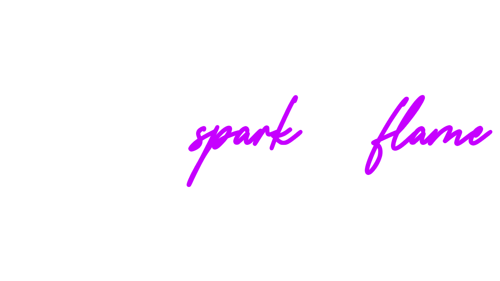

  
  <h1>Spark Laboratories</h1>
  
<strong>Innovating at the intersection of Hardware, Neurotechnology, and MedTech.</strong>

  
  
  
  

 

### 🔬 About Us

We are a **Deeptech startup** based in **Maringá, Brazil**, dedicated to developing cutting-edge hardware solutions from the ground up. Our mission is to bridge the gap between complex engineering and practical applications.

---

### 🛠️ Tech Stack & Engineering

We build physical products powered by robust software.

| **Category** | **Technologies** |
| :--- | :--- |
| **Embedded & Edge AI** |      |
| **Hardware Design (EDA)** |    |
| **Product Design** |   |
| **Manufacturing** |   |
| **Software** |     |
---

### 🚀 Featured Internal Projects

#### 🔹 The Flow Project
*Status: In Development / Private Beta* An IoT-enabled device designed to optimize clinical environments.

#### 🔹 The Weevil Project
*Status: R&D / Confidential* Advanced robotics platform for high-precision tasks.

#### 🔹 The Second Heart Project
*Status: R&D / Confidential* Next-generation MedTech device focused on circulatory support systems.

#### 🔹 The Continuum Project
*Status: Early Prototyping* Experimental hardware exploring new frontiers in continuous monitoring.

> *Note: Repositories for these projects are currently private for IP protection.*

---

### 🤝 Partner Projects & Services

In addition to our internal R&D, Spark Laboratories operates as a specialized engineering partner for select clients.

**Confidential Client Projects:**
We currently have multiple active projects under strict NDA, developing custom hardware and firmware solutions for partners in the industry.

**Build With Us:**
Do you have a vision for a physical technology product? We offer end-to-end development services—from proof of concept to manufacturing strategy.

[**Get in Touch to Discuss Your Project**](mailto:contato@sparklaboratories.com.br)

---

  
  © 2026 Spark Laboratories. All rights reserved.

